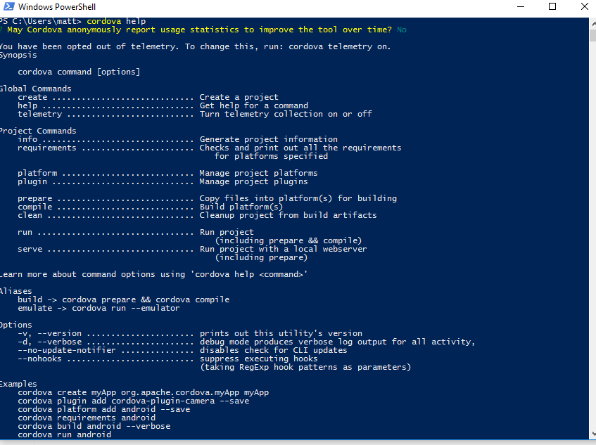
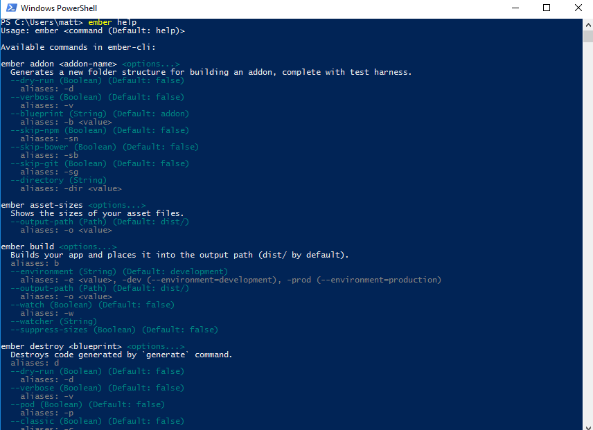
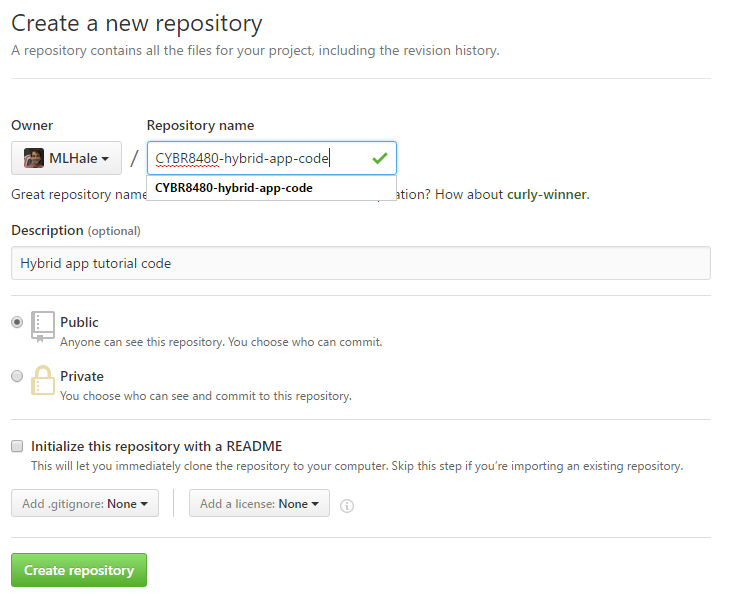

# Building a Hybrid App in Android and Ember

### Table of Contents
[Introduction](#introduction)  
[Installing Cordova and Ember](#installing-cordova-and-ember)

### Introduction

Hybrid apps are what you get when web apps and native apps have a baby. The core limitation of web apps in mobile environments is there inability to access native device features (e.g. photo libraries, keyboard functions, and bluetooth capabilities - to name a few). The core strength of web apps is their ability to be deployed cross-platform. That is, a web app is the same for Android as it is for iOS or Windows phone. This means developers can iterate much quicker without the need to develop stand alone siloed code for different platforms. 

On the flip side, native apps have all of the tight control of mobile operating system and hardware capabilities, but at the cost of being developed in platform specific languages and paradigms. This measn that developers supporting multiple native apps must individually change each code base if they wish to put out an update to their app.

Hybrid apps get the best of both worlds - access to native features, while still being built as a cross-platform web-app. How does this work you ask? Well hybrid apps operate in a native platform-specific 'container.' This native container provides API access to native features to a web app core (where the majority of the app lives). So developers can write one app and just map it to many containers. 

The content of this lesson explores these concepts and helps you build your first cross-platform hybrid app using Apache Cordova and Ember JS.

Our entire setup uses Free and Open Source Software (FOSS). When using FOSS, respect its copyright and license restrictions. These obligations and rights are typically conveyed in a LICENSE file.

[Top](#table-of-contents)

### Installing Cordova and Ember
#### Foreword

This guide assumes you have already installed git (github desktop for windows users) and npm. The guide also assumes both of these packages are available at the command line (or in a power shell). If you do not meet this requirement, see [installing git on mac/windows](https://desktop.github.com/) or (for linux) just:

```
sudo apt-get install git
```

To install node and npm (the node package manager), visit [https://nodejs.org/en/](https://nodejs.org/en/)
#### Installing Cordova

Apache Cordova is a framework that contains a number of native wrappers (containers) that map hardware and operating system features from various vendors (android, ios, etc) to what are called ```webviews```. Webviews are essentially mini-browser windows that re-use the browser capabilities built into mobile operating systems to render HTML, CSS, and Javascript. Cordova allows this view to access approved device features. To get started:

```
npm install -g cordova
```

Cordova supports basically all major mobile platforms and operating systems. Below is some information about support platforms and the open source license used.

---
license: >
    Licensed to the Apache Software Foundation (ASF) under one
    or more contributor license agreements.  See the NOTICE file
    distributed with this work for additional information
    regarding copyright ownership.  The ASF licenses this file
    to you under the Apache License, Version 2.0 (the
    "License"); you may not use this file except in compliance
    with the License.  You may obtain a copy of the License at

        http://www.apache.org/licenses/LICENSE-2.0

    Unless required by applicable law or agreed to in writing,
    software distributed under the License is distributed on an
    "AS IS" BASIS, WITHOUT WARRANTIES OR CONDITIONS OF ANY
    KIND, either express or implied.  See the License for the
    specific language governing permissions and limitations
    under the License.

title: Cordova support by platform
toc_title: Platform support
description: Compatibility table for all major plugins and features.
---

#### Cordova Architecture


#### Platform Support

The following shows the set of development tools and device APIs
available for each mobile platform. The device APIs listed here are provided by
the core plugins, additional APIs are available via
[third-party plugins](http://plugins.cordova.io). Column headers display the
CLI's shorthand names.

<!-- START HTML -->

<table class="compat" width="100%">

    <thead>
        <tr>
            <th></td>
            <th>android</th>
            <th>blackberry10</th>
            <th>ios</th>
            <th>Ubuntu</th>
            <th>wp8<br/>(Windows Phone 8)</th>
            <th>windows<br/>(8.1, 10,<br/>Phone 8.1)</th>
            <th>OS X</th>
        </tr>

    </thead>

    <tbody>
        <tr>
            <th><a href="../cli/index.html">cordova<br/>CLI</a></th>
            <td data-col="android"    class="y">Mac, Windows, Linux</td>
            <td data-col="blackberry10" class="y">Mac, Windows, Linux</td>
            <td data-col="ios"        class="y">Mac</td>
            <td data-col="ubuntu"        class="y">Ubuntu</td>
            <td data-col="winphone8"  class="y">Windows</td>
            <td data-col="win8"       class="y"></td>
            <td data-col="osx"       class="y">Mac</td>
        </tr>

        <tr>
            <th><a href="../hybrid/webviews/index.html">Embedded<br/>WebView</a></th>
            <td data-col="android"    class="y"><a href="../platforms/android/webview.html">(see details)</a></td>
            <td data-col="blackberry10" class="n"></td>
            <td data-col="ios"        class="y"><a href="../platforms/ios/webview.html">(see details)</a></td>
            <td data-col="ubuntu"        class="y"></td>
            <td data-col="winphone8"  class="n"></td>
            <td data-col="win8"       class="n"></td>
            <td data-col="osx"       class="y"></td>
        </tr>

        <tr>
            <th><a href="../hybrid/plugins/index.html">Plugin<br/>Interface</a></th>
            <td data-col="android"    class="y"><a href="../platforms/android/plugin.html">(see details)</a></td>
            <td data-col="blackberry10" class="y"><a href="../platforms/blackberry10/plugin.html">(see details)</a></td>
            <td data-col="ios"        class="y"><a href="../platforms/ios/plugin.html">(see details)</a></td>
            <td data-col="ubuntu"        class="y"></td>
            <td data-col="winphone8"  class="y"><a href="../platforms/wp8/plugin.html">(see details)</a></td>
            <td data-col="win8"       class="y"></td>
            <td data-col="osx"       class="y"></td>
        </tr>

        <tr>
            <th></th>
            <th colspan="20"><h2>Core Plugin APIs</h2></th>
        </tr>

        <tr>
            <th><a href="../../reference/cordova-plugin-device-motion/">Accelerometer</a></th>
            <td data-col="android"    class="y"></td>
            <td data-col="blackberry10" class="y"></td>
            <td data-col="ios"        class="y"></td>
            <td data-col="ubuntu"        class="y"></td>
            <td data-col="winphone8"  class="y"></td>
            <td data-col="win8"       class="y"></td>
            <td data-col="osx"       class="n"></td>
        </tr>

        <tr>
            <th><a href="../../reference/cordova-plugin-battery-status/">BatteryStatus</a></th>
            <td data-col="android"    class="y"></td>
            <td data-col="blackberry10" class="y"></td>
            <td data-col="ios"        class="y"></td>
            <td data-col="ubuntu"        class="y"></td>
            <td data-col="winphone8"  class="y"></td>
            <td data-col="win8"       class="y">* Windows Phone 8.1 only</td>
            <td data-col="osx"       class="n"></td>
        </tr>

        <tr>
            <th><a href="../../reference/cordova-plugin-camera/">Camera</a></th>
            <td data-col="android"    class="y"></td>
            <td data-col="blackberry10" class="y"></td>
            <td data-col="ios"        class="y"></td>
            <td data-col="ubuntu"        class="y"></td>
            <td data-col="winphone8"  class="y"></td>
            <td data-col="win8"       class="y"></td>
            <td data-col="osx"       class="n"></td>
        </tr>

        <tr>
            <th><a href="../../reference/cordova-plugin-media-capture/">Capture</a></th>
            <td data-col="android"    class="y"></td>
            <td data-col="blackberry10" class="y"></td>
            <td data-col="ios"        class="y"></td>
            <td data-col="ubuntu"        class="y"></td>
            <td data-col="winphone8"  class="y"></td>
            <td data-col="win8"       class="y"></td>
            <td data-col="osx"       class="n"></td>
        </tr>

        <tr>
            <th><a href="../../reference/cordova-plugin-device-orientation/">Compass</a></th>
            <td data-col="android"    class="y"></td>
            <td data-col="blackberry10" class="y"></td>
            <td data-col="ios"        class="y">(3GS+)</td>
            <td data-col="ubuntu"        class="y"></td>
            <td data-col="winphone8"  class="y"></td>
            <td data-col="win8"       class="y"></td>
            <td data-col="osx"       class="n"></td>
        </tr>

        <tr>
            <th><a href="../../reference/cordova-plugin-network-information/">Connection</a></th>
            <td data-col="android"    class="y"></td>
            <td data-col="blackberry10" class="y"></td>
            <td data-col="ios"        class="y"></td>
            <td data-col="ubuntu"        class="y"></td>
            <td data-col="winphone8"  class="y"></td>
            <td data-col="win8"       class="y"></td>
            <td data-col="osx"       class="n"></td>
        </tr>

        <tr>
            <th><a href="../../reference/cordova-plugin-contacts/">Contacts</a></th>
            <td data-col="android"    class="y"></td>
            <td data-col="blackberry10" class="y"></td>
            <td data-col="ios"        class="y"></td>
            <td data-col="ubuntu"        class="p">desktop only</td>
            <td data-col="winphone8"  class="y"></td>
            <td data-col="win8"       class="p">partially</td>
            <td data-col="osx"       class="n"></td>
        </tr>

        <tr>
            <th><a href="../../reference/cordova-plugin-device/">Device</a></th>
            <td data-col="android"    class="y"></td>
            <td data-col="blackberry10" class="y"></td>
            <td data-col="ios"        class="y"></td>
            <td data-col="ubuntu"        class="y"></td>
            <td data-col="winphone8"  class="y"></td>
            <td data-col="win8"       class="y"></td>
            <td data-col="osx"       class="y"></td>
        </tr>

        <tr>
            <th><a href="../../cordova/events/events.html">Events</a></th>
            <td data-col="android"    class="y"></td>
            <td data-col="blackberry10" class="y"></td>
            <td data-col="ios"        class="y"></td>
            <td data-col="ubuntu"        class="y"></td>
            <td data-col="winphone8"  class="y"></td>
            <td data-col="win8"       class="y"></td>
            <td data-col="osx"       class="n"></td>
        </tr>

        <tr>
            <th><a href="../../reference/cordova-plugin-file">File</a></th>
            <td data-col="android"    class="y"></td>
            <td data-col="blackberry10" class="y"></td>
            <td data-col="ios"        class="y"></td>
            <td data-col="ubuntu"        class="y"></td>
            <td data-col="winphone8"  class="y"></td>
            <td data-col="win8"       class="y"></td>
            <td data-col="osx"       class="y"></td>
        </tr>

        <tr>
            <th><a href="../../reference/cordova-plugin-file-transfer/">File Transfer</a></th>
            <td data-col="android"    class="y"></td>
            <td data-col="blackberry10" class="y">* Do not support onprogress nor abort</td>
            <td data-col="ios"        class="y"></td>
            <td data-col="ubuntu"        class="n"></td>
            <td data-col="winphone8"  class="y">* Do not support onprogress nor abort</td>
            <td data-col="win8"       class="y">* Do not support onprogress nor abort</td>
            <td data-col="osx"       class="n"></td>
        </tr>

        <tr>
            <th><a href="../../reference/cordova-plugin-geolocation/">Geolocation</a></th>
            <td data-col="android"    class="y"></td>
            <td data-col="blackberry10" class="y"></td>
            <td data-col="ios"        class="y"></td>
            <td data-col="ubuntu"        class="y"></td>
            <td data-col="winphone8"  class="y"></td>
            <td data-col="win8"       class="y"></td>
            <td data-col="osx"       class="n"></td>
        </tr>

        <tr>
            <th><a href="../../reference/cordova-plugin-globalization/">Globalization</a></th>
            <td data-col="android"    class="y"></td>
            <td data-col="blackberry10" class="y"></td>
            <td data-col="ios"        class="y"></td>
            <td data-col="ubuntu"        class="y"></td>
            <td data-col="winphone8"  class="y"></td>
            <td data-col="win8"       class="y"></td>
            <td data-col="osx"       class="n"></td>
        </tr>

        <tr>
            <th><a href="../../reference/cordova-plugin-inappbrowser/">InAppBrowser</a></th>
            <td data-col="android"    class="y"></td>
            <td data-col="blackberry10" class="y"></td>
            <td data-col="ios"        class="y"></td>
            <td data-col="ubuntu"        class="y"></td>
            <td data-col="winphone8"  class="y"></td>
            <td data-col="win8"       class="p">uses iframe</td>
            <td data-col="osx"       class="n"></td>
        </tr>

        <tr>
            <th><a href="../../reference/cordova-plugin-media/">Media</a></th>
            <td data-col="android"    class="y"></td>
            <td data-col="blackberry10" class="y"></td>
            <td data-col="ios"        class="y"></td>
            <td data-col="ubuntu"        class="y"></td>
            <td data-col="winphone8"  class="y"></td>
            <td data-col="win8"       class="y"></td>
        </tr>

        <tr>
            <th><a href="../../reference/cordova-plugin-dialogs/">Notification</a></th>
            <td data-col="android"    class="y"></td>
            <td data-col="blackberry10" class="y"></td>
            <td data-col="ios"        class="y"></td>
            <td data-col="ubuntu"        class="y"></td>
            <td data-col="winphone8"  class="y"></td>
            <td data-col="win8"       class="y"></td>
            <td data-col="osx"       class="n"></td>
        </tr>

        <tr>
            <th><a href="../../reference/cordova-plugin-splashscreen/">Splashscreen</a></th>
            <td data-col="android"    class="y"></td>
            <td data-col="blackberry10" class="y"></td>
            <td data-col="ios"        class="y"></td>
            <td data-col="ubuntu"        class="y"></td>
            <td data-col="winphone8"  class="y"></td>
            <td data-col="win8"       class="y"></td>
            <td data-col="osx"       class="n"></td>
        </tr>

        <tr>
            <th><a href="../../reference/cordova-plugin-statusbar/">Status Bar</a></th>
            <td data-col="android"    class="y"></td>
            <td data-col="blackberry10" class="n"></td>
            <td data-col="ios"        class="y"></td>
            <td data-col="ubuntu"        class="n"></td>
            <td data-col="winphone8"  class="y"></td>
            <td data-col="win8"       class="y">Windows Phone 8.1 only</td>
            <td data-col="osx"       class="n"></td>
        </tr>

        <tr>
            <th><a href="../../cordova/storage/storage.html">Storage</a></th>
            <td data-col="android"    class="y"></td>
            <td data-col="blackberry10" class="y"></td>
            <td data-col="ios"        class="y"></td>
            <td data-col="ubuntu"        class="y"></td>
            <td data-col="winphone8"  class="y">localStorage &amp; indexedDB</td>
            <td data-col="win8"       class="y">localStorage &amp; indexedDB</td>
            <td data-col="osx"       class="n"></td>
        </tr>

        <tr>
            <th><a href="../../reference/cordova-plugin-vibration/">Vibration</a></th>
            <td data-col="android"    class="y"></td>
            <td data-col="blackberry10" class="y"></td>
            <td data-col="ios"        class="y"></td>
            <td data-col="ubuntu"        class="y"></td>
            <td data-col="winphone8"  class="y"></td>
            <td data-col="win8"       class="y">* Windows Phone 8.1 only</td>
            <td data-col="osx"       class="n"></td>
        </tr>

    </tbody>
</table>

<!-- END HTML -->

#### Installing Ember
Since we will be building our app in Ember, lets also install the Ember CLI you worked with before in sec. web dev.

```
npm install -g ember-cli
```

Now you should be able to interact on the command line and see the cordova and ember build tools functioning:

```
cordova help
```


> If you dont see content similar to this, check to ensure your cordova install worked

```
ember help
```


> If you dont see content similar to this, check to ensure your ember install worked.

#### Creating a new ember project

Lets start an empty ember project that we can use to demo the app. We will modify this later (and track its changes on github).
> I suggest you first create a new folder somewhere where you'd like to store the files, then cd into that directory

```
ember new hybridapp
```


> This may take a few minutes

Create a new repo on github by visiting [https://github.com/new](https://github.com/new). Give it a name, I named mine CYBR-hybrid-app-code so I could share it with all of you. You can call yours simply ```hybridapp``` if you like.



Lets switch back to our shell and commit the code to our new github repo
```
cd hybridapp
git status
git remote add origin <your repo url goes here>
git push -u origin master
```

#### Installing an ember addon to make ember and cordova play nice
There is a handy ember addon (built by [@poetic](https://github.com/poetic/ember-cli-cordova) and [@isleofcode](https://github.com/isleofcode/ember-cordova)) that makes cordova cli and ember cli seamlessly (and I mean really seamlessly) work together. Lets install it.

```
ember install ember-cordova
```

[Top](#table-of-contents)

####


#### License
<a rel="license" href="http://creativecommons.org/licenses/by-nc-sa/4.0/"></a><br /><span xmlns:dct="http://purl.org/dc/terms/" property="dct:title">CYBER8480</span> by <a xmlns:cc="http://creativecommons.org/ns#" href="http://faculty.ist.unomaha.edu/mlhale" property="cc:attributionName" rel="cc:attributionURL">Matt Hale</a> work is licensed under a <a rel="license" href="http://creativecommons.org/licenses/by-nc-sa/4.0/">Creative Commons Attribution-NonCommercial-ShareAlike 4.0 International License</a>.